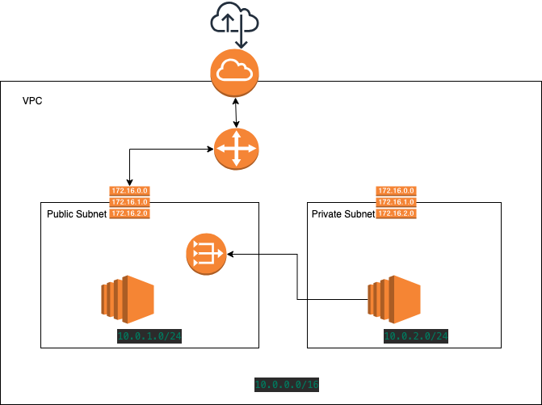

# AWS Infrastructure

Setup AWS infrastructure using Terraform

1. Create VPC
2. Two subnets (private and public)
3. Create internet gateway
4. Create public and private route tables
5. Create NAT Gateway in the public subnet 
7. Assign route table to public and private subnet
8. Link private route table with the NAT gateway 
9. Create two EC2 instances inside public and private subnets; 1 each 
10. Public EC2 instance to SSH from anywhere in the world from public internet
11. Private EC2 instance to SSH from public EC2 instance within the VPC

